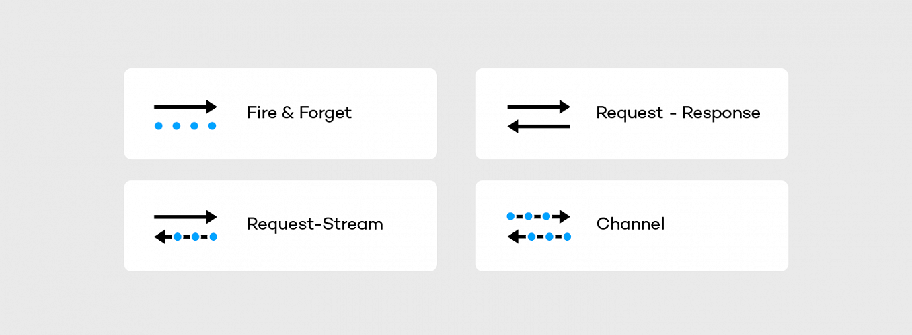

# RSocket Cloudflow Ingress

This project is based on the articles [RSocket Intro](https://www.baeldung.com/rsocket)
[Reactive Service-to-service](https://dzone.com/articles/reactive-service-to-service-communication-with-rso-1)
and [Reactor](https://www.baeldung.com/reactor-core) and cloudflow [sensor example](https://github.com/lightbend/cloudflow/tree/master/examples/snippets/modules/ROOT/examples/sensor-data-scala)
See also presentations [here](https://www.youtube.com/watch?v=QJ3xw0MF-3U&list=PLQ4mEUUwQwBoGe4UX5mVbsNkt7DPk03Dl)

The actual RSocket code is modeled after this [one](https://github.com/b3rnoulli/rsocket-examples)

## Why RSocket?

As described [here](https://dzone.com/articles/reactive-service-to-service-communication-with-rso-1)

RSocket is a new, message-driven, binary protocol that standardizes the approach to communication in the cloud. It helps to resolve common application concerns in a consistent manner as well as it has support for multiple languages (e.g java, js, python) and transport layers (TCP, WebSocket, Aeron). 

The main RSocket characteristics are:
* Message driven - Interaction in RSocket is broken down into frames. 
* Performance - The frames are sent as a stream of bytes. It makes RSocket way more efficient than typical text-based protocols.
* Reactiveness and Flow Control - RSocket protocol fully embraces the principles stated in the Reactive Manifesto.

RSocket supports the following communication styles

* The fire and forget is designed to push the data from the sender to the receiver. 
* The request-response semantics mimics HTTP behavior.
* The request stream operation - the requester sends a single frame to the responder and gets back the stream (infinite) of data. Such interaction method enables services to switch from the pull data to the push data strategy.
* The request channel allows to stream the data from the requester to the responder and the other way around using a single physical connection. 

Here we demonstrate usage of fire and forget and and request stream implementation as an RSocket ingress.

## Project structure
Project contains several modules:
* `images` - contains images for this Readme
* `interactions` - initial experimentations with RSockets, based on this [code](https://github.com/b3rnoulli/rsocket-examples).
* `support` is a shared project containing Avro definitions and shared transformation code
* `sensordata` is a cloudflow implementation for the [Sensor data Processing](https://cloudflow.io/docs/current/get-started/hello-world-example.html)
* `rsocketproducer` is an implementation of rsocket-based data provider for publishing sensor data.

## Cloudflow implementation

The idea behind implementation is to replace HTTP Ingress from the original implementation with the RSocket ingress.
Three different ingress implementations are provided:
* Fire and forget JSON based ingress implemented by the [class](sensordata/src/main/scala/com/lightbend/sensordata/RSocketIngress.scala).
Here Rsocket `fire and forget` interactions are used and sensor data is passed as text JSON.
* Fire and forget Avro based ingress implemented by the [class](sensordata/src/main/scala/com/lightbend/sensordata/RSocketBinaryIngress.scala).
Here Rsocket `fire and forget` interactions are used and sensor data is passed as Avro encoded binary.
* Stream Avro based ingress implemented by the [class](sensordata/src/main/scala/com/lightbend/sensordata/RSocketStreamIngress.scala).
Here Rsocket `request-stream` interactions are used and sensor data is passed as Avro encoded binary. 

Any of the implementations can be used. To pick the one that you want to use, go to [blueprint](sensordata/src/main/blueprint/blueprint.conf)
and uncomment the one that you want to experiment with.

To support these three interactions there are three data publishers:
* [JSON Fire and forget](rsocketproducer/src/main/scala/com/lightbend/sensordata/producer/RSocketPublisher.scala)
* [Binary Fire and forget](rsocketproducer/src/main/scala/com/lightbend/sensordata/producer/RSocketPublisherBinary.scala)
* [Binary Streaming](rsocketproducer/src/main/scala/com/lightbend/sensordata/producer/BinaryStreamingPublisher.scala)

## Running locally

To run locally:
* Start cloudflow implementation
````
sbt runLocal 
````
* Tail log provided by a previous command
* Run corresponding data provider

## Running on GCP
WIP
